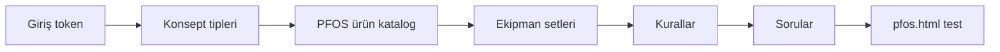

# Proje akışı — Sorular, Kurallar, Ürün, Setler, Konsept

`/yonetim/pfos` → **Özet & legacy** sekmesindeki sayaçlar, tek dosyadan gelir:  
`public/data/proje-akis.json` (API: `GET/POST /api/proje-akis`).

Bu yapı **pfos.html + admin.html** “kural motoru” hattını besler.  
**Yeni teklif motoru** (`/yonetim/pfos` → Teklif oluştur) ise `lib/pfos` içindeki 6 konsept şablonunu kullanır — ayrı hat.

---

## Önce: “Yetkisiz” ve hepsi 0 görünmesi

Özet paneli veriyi **Bearer token** ile çeker. Token yok/yanlışsa API `Yetkisiz` döner → sayaçlar **0** kalır (veri yok sanmayın).

1. `/yonetim/giris` → `.env` içindeki `EQUSTO_ADMIN_BEARER` değerini yapıştırın (tırnaklar olmadan).
2. Girişten sonra `/yonetim/pfos` → **Yenile** (veya sekmeyi kapat-aç).

Yerel geliştirmede token yoksa `equsto2025` denenebilir (`lib/auth.ts`).

---

## Beş alan ne işe yarar?

| Sayaç | JSON alanı | Ne? | Nerede düzenlenir (bugün) |
|--------|------------|-----|---------------------------|
| **Sorular** | `questions[]` | Müşteri sihirbazı adımları (meslek, konsept, m², adres…) | `admin.html` → Proje Fabrikası → Sorular → **↺ Varsayılanları Yükle** |
| **Konsept** | `shopTypes[]` | İşletme tipi (Restaurant — Steakhouse, Balık…) | `admin.html` → Konsept tipleri → **Varsayılanları yükle** |
| **PFOS ürün** | `products[]` | Katalogdan PFOS’ta seçilebilir ürünler (`proje_fab_aktif`) | `admin.html` → Ürünler (katalog senkron) |
| **Setler** | `eqSets[]` | Ürün paketleri (ör. “Steakhouse 115 m² — pişirme seti”) | `admin.html` → Ekipman setleri |
| **Kurallar** | `rules[]` | “Şu konsept + şu cevaplar → şu set” | `admin.html` → Kurallar |

**Steakhouse / Balıkçı m² listeleri** (Excel): `/yonetim/pfos` → **Kategoriler** → `pfos-referans/*.json`. Motor: `steakhouse` / `balikci` konseptleri `POST /api/pfos/quote` ile bu listelerden teklif üretir (`pfos.html` → `EqustoPfosTemplateApi`).

---

## Önerilen kurulum sırası

1. **Konsept** — En azından Steakhouse, Balık, Kebap, Coffee Shop tipleri (`restaurant_steakhouse`, `restaurant_balik`, …).
2. **PFOS ürün** — E-ticaret kataloğunu çekin; PFOS’ta kullanılacakları işaretleyin.
3. **Setler** — Konsept başına mantıklı ürün grupları (veya önce tek “genel mutfak” seti).
4. **Kurallar** — Örn. `typeId=restaurant_steakhouse` + m² aralığı → ilgili `eqSet`.
5. **Sorular** — Tam PFOS adım sırası için admin’de varsayılan soru setini yükleyin; kaydedince `proje-akis.json` güncellenir.

Her kayıt admin’de **persist** → `POST /api/proje-akis` → `proje-akis.json`.

---

## İki motor — hangisini hedefliyoruz?

| | Legacy (proje-akis) | Yeni (`lib/pfos`) |
|--|---------------------|-------------------|
| Müşteri UI | `pfos.html` | `/yonetim/pfos` Teklif oluştur |
| Konsept | `shopTypes` + sorular | 6 slug (coffee-shop, turk-restoran, …) |
| Liste kaynağı | `eqSets` + kurallar | Konsept `template` + zone katalog |
| Steakhouse/Balık | Henüz shopTypes + referans JSON | **Kategoriler** sekmesinde m² listeler hazır |

Kısa vadede: **m² Excel listeleri** → Kategoriler; **canlı teklif** için ya legacy zinciri (set+kural) ya da yeni motora `steakhouse` / `balikci` şablonu eklenmeli.

---

## Hızlı kontrol

- Dosya: `E-TICARET/site/public/data/proje-akis.json`
- Şu an tipik durum: `questions` dolu, `shopTypes` / `rules` / `eqSets` **boş** → Özet’te Konsept/Kurallar/Setler = 0.
- `products` çok satır olabilir; token yoksa yine 0 görünür.

---

## Uygulama (A + B birlikte)

| Parça | Nerede |
|--------|--------|
| **A — Proje akışı** | `/yonetim/pfos` → **Proje akışı (A)** → konsept / soru yükle → kaydet |
| **B — Motor** | `steakhouse` / `balikci` slug → `/yonetim/pfos` **Teklif oluştur**; m² ≤150 → 80-150 listesi, >150 → 150-250 |
| **B — Listeler** | **Kategoriler** sekmesi veya `node scripts/seed-pfos-kategoriler.mjs` |

Set + kural zinciri hâlâ **admin.html** (ileride panele taşınacak).
