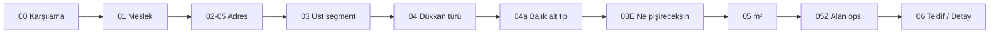

# PFOS — Soru seti kataloğu (v3)

| Alan | Değer |
|------|--------|
| Kaynak | `EQUSTO SORU SETİ v3.docx` (Proje Fabrikası) |
| Kategori | `kategori-agaci/pfos-yeme-icecek-agaci.json` |
| Kod (seed) | `E-TICARET/site/lib/pfos/proje-akis/wizard-questions.ts` |
| Akış notu | `PFOS-SORU-KONSEPTI.md` |

**Amaç:** Proje toplantısındaki üç eksen — **konsept (02→03)**, **m²**, **menü** — için soru kartlarının tek tablosu.

---

## 1. Akış özeti (blok → PFOS adım)

| Blok | Adım | Panel | Soru sayısı | Motor etkisi |
|------|------|-------|-------------|--------------|
| 0 | 00 | Karşılama | 1 | Yok |
| 1 | 01 | Kimlik | 1 | Analitik |
| 2 | 02–05B | Lokasyon | 5 | Nakliye / montaj / AI segment |
| 3 | 03 | **02 üst segment** | 1 | `ust-segment` filtresi |
| 4 | 04 | **03 dükkan türü** | 1 (+ koşullu alt) | `konsept.id` → `motorSlug` |
| 5 | 03E | Menü hattı | 1 | Zone / davlumbaz ipucu |
| 6 | 05 | Toplam m² | 1 | Bant / referans ölçek |
| 7 | 05Z | Alan m² (ops.) | 1+ | Faz 2 — zone kataloğu |
| 8 | 06 | Çıktı | 1 (+ detay dalı) | PDF / detaylandır |

---

## 2. Ana katalog — tüm soru kartları

**Durum:** `kod` = `wizard-questions.ts` veya panelde; `taslak` = docx + bu katalog; `sonra` = faz 2 / motor yok.

| # | id | adım | panel | Metin (kısa) | type | zorunlu | gosterIf | mapsTo | motor / etki | durum |
|---|-----|------|-------|--------------|------|---------|----------|--------|--------------|-------|
| 0 | `q_karsilama` | 00 | A0 | Mr. Equsto / hoş geldiniz | info | — | — | — | Ton, rol ipucu | taslak |
| 1 | `q_meslek` | 01 | A | Mesleğiniz | select | evet | — | — | Analitik | **kod** |
| 2 | `q_sehir` | 02 | B | Şehir | select/text | evet | — | `lokasyon.sehir` | Segment AI | taslak |
| 3 | `q_ilce` | 03 | B | İlçe | select | evet | `q_sehir` dolu | `lokasyon.ilce` | Montaj bölgesi | taslak |
| 4 | `q_mahalle` | 04 | B | Mahalle | select | hayır | `q_ilce` | `lokasyon.mahalle` | Adres | taslak |
| 5 | `q_cadde` | 05A | B | Cadde | text | hayır | `q_ilce` | `lokasyon.cadde` | Adres | taslak |
| 6 | `q_sokak` | 05B | B | Sokak / bina no | text | hayır | `q_ilce` | `lokasyon.sokak` | Nakliye | taslak |
| 6b | `q_lokasyon` | 5A | B′ | Şehir / bölge (tek alan) | text | hayır | — | `lokasyon` | Geçici birleşik | **kod** |
| 6c | `q_acik_adres` | 5B | B′ | Açık adres notu | text | hayır | — | `lokasyon.not` | Geçici birleşik | **kod** |
| 7 | `q_ust_segment` | 03 | C1 | Ne tür işletme? (**02**) | select | evet | — | `agac.ust-segment` | `q_dukkan_turu` seçenekleri | taslak |
| 8 | `q_konsept` | 03 | C1′ | Konsept (düz liste) | select | evet | — | karışık 02+03 | Eski birleşik soru | **kod** |
| 9 | `q_dukkan_turu` | 04 | C2 | Dükkan türü (**03**) | select | evet | `q_ust_segment` | `konsept.id` | `motorSlug` tetikler | **kod** |
| 10 | `q_balik_alt` | 04a | C3 | Balık işletme modeli | select | evet | `dukkan ∈ {Balık…}` | `restaurant_balik` | `mahalle` \| `80-150` \| `150-250` | taslak |
| 11 | `q_fast_alt` | 04b | C3 | Fast food alt tip | select | evet | `ust=Fast food` | `fast_food` | Burger, FC, Döner… | taslak |
| 12 | `q_servis_model` | 04c | C3 | Servis modeli | select | hayır | Restaurant / FF | — | Oturma ölçeği; listeyi değiştirmez | taslak |
| 13 | `q_ne_pisireceksin` | 03E | D | Ne pişireceksiniz? | multi_select | evet | konsept seçili | menü hattı | Zone ipucu | **kod** |
| 14 | `q_m2` | 05 | E | Toplam kullanım alanı (m²) | number | evet | `konsept` + motor | `m2` | Bant / ölçek | **kod** |
| 15 | `q_m2_alanlar` | 05Z | E2 | Alan bazlı m² (mutfak, salon…) | repeater | hayır | detaylandır | `zones[]` | Faz 2 | sonra |
| 16 | `q_karar` | 06 | F | Sonraki adım | select | evet | `q_m2` | — | Teklif / Detay | **kod** |
| 17 | `q_detay_yardimci` | 06D | F2 | Yardımcı ekipman (max 6) | multi | hayır | `karar=Detaylandır` | — | Teklifle çakışmasın | taslak |

### 2.1 `q_meslek` seçenekleri

| Docx (hedef) | Kod (şimdi) |
|--------------|-------------|
| Yatırımcı | — |
| Şef / Aşçı | — |
| Satınalmacı | — |
| Mimar | — |
| Franchise | Franchise |
| Söylemek istemiyorum | — |
| — | Restoran / Kafe, Otel, Catering, Bilmiyorum |

### 2.2 `q_ust_segment` — 02 üst alan (docx + PFOS)

| id (öneri) | Etiket | Ayrı kalma gerekçesi |
|------------|--------|----------------------|
| `restaurant` | Restoran | Tam mutfak, menü derinliği, m² bantları |
| `kafe` | Kafe / Coffee Shop | İçecek + hafif mutfak, farklı liste |
| `fast-food` | Fast Food / QSR | Hız, paket, standart modül |
| `pastane` | Pastane & Fırın | Fırın hattı, soğuk depo |
| `bar` | Bar & Lounge | İçecek ağırlıklı, az pişirme |
| `otel` | Otel F&B | Oda kahvaltı / A la carte / banquet |
| `catering` | Catering | kg/gün, taşıma |
| `bulut-mutfak` | Bulut Mutfak | Üretim, teslimat |
| `uretim` | Üretim / Fabrika | 500–10000 m² (docx) |
| `bilmiyorum` | Bilmiyorum | Genel şablon |

**Ağaçta şu an (yeme-içecek JSON):** `restaurant`, `kafe`, `fast-food` — diğerleri soruda görünür, motor `planlanan`.

### 2.3 `q_dukkan_turu` — 03 seçenekleri (üst segmente göre)

#### Restaurant (`q_ust_segment = restaurant`)

| Seçenek (soru) | konsept.id | motorSlug | Motor durumu |
|----------------|------------|-----------|--------------|
| Steakhouse | `restaurant_steakhouse` | `steakhouse` | aktif |
| Balık Restaurant | `restaurant_balik` | `balikci` | aktif (+ alt tip) |
| Kebapçı | `restaurant_kebap` | `kebap-ortadogu` | aktif |
| Pizzacı | `pizzaci` | `pizzaci` | motor |
| Türk / Esnaf lokanta | `turk_restoran` | `turk-restoran` | motor |
| Meyhane | `meyhane` | `meyhane` | motor |
| All Dining Cafe | `all_day_dining` | `all-day-dining-cafe` | motor |
| Fine Dining | — | — | docx; `ne_pisireceksin` |
| Dünya Mutfağı | — | — | docx |
| Gurme Şarküteri | — | — | docx |
| Bilmiyorum | — | — | genel |

#### Kafe (`q_ust_segment = kafe`)

| Seçenek | konsept.id | motorSlug | Not |
|---------|------------|-----------|-----|
| Coffee Shop | `coffee_shop` | `coffee-shop` | aktif |
| Kafeterya | — | — | docx; All Dining ile çakışma — **TBD** |
| Pastane / Fırın | `pastane` | — | planlanan (üst: kafe veya pastane?) |
| Bilmiyorum | — | — | |

#### Fast food

| Seçenek | konsept.id | motorSlug |
|---------|------------|-----------|
| Burger | `fast_food` | — |
| Pizza (paket) | `fast_food` | — |
| Fried Chicken | `fast_food` | — |
| Döner / Dürüm | `fast_food` | — |
| Pide / Lahmacun | `fast_food` | — |
| Bilmiyorum | — | — |

#### Pastane (üst = pastane)

| Seçenek | konsept.id | motorSlug |
|---------|------------|-----------|
| Artisan / butik | `pastane` | planlanan |
| Endüstriyel fırın | `pastane` | planlanan |
| Gelato (sonra) | — | — |

#### Otel / Bar / Catering / Bulut / Üretim

Soru setinde **üst segment** olarak listelenir; alt `q_dukkan_turu` docx dalları (ör. Oda & Kahvaltı, Kokteyl bar, Banket) — motor bağlanıncaya kadar mesaj: *liste hazırlanıyor*.

### 2.4 `q_balik_alt` (sadece balık 03)

| Seçenek | Liste / bant |
|---------|----------------|
| Mahalle balıkçısı | `balikci-mahalle` |
| Balık Restaurant | m² → `80-150` / `150-250` |
| Balık lokantası | m² bant |
| Seafood bistro | `balikci` (alt tip TBD) |

### 2.5 `q_ne_pisireceksin` — menü hattı

| Seçenek | Konsept doğrulama | Zone ipucu |
|---------|-------------------|------------|
| Izgara | Steakhouse, kebap | Izgara / davlumbaz |
| Balık / Deniz | Balıkçı | Balık pişirme |
| Kebap | Kebapçı | Ocakbaşı |
| Pizza | Pizzacı | Fırın |
| Kahve / İçecek | Coffee shop | Barista |
| Pastane / Fırın | Pastane | Fırın |
| Meze | Meyhane | Soğuk / sıcak |
| Ev yemekleri | Türk restoran | Karma |
| Bilmiyorum | — | Genel |

**Kodda şimdi:** Izgara, Balık, Kebap, Kahve, Bilmiyorum.

### 2.6 `q_m2` — konsepte göre etki

| motorSlug | Kural | Referans |
|-----------|--------|----------|
| `steakhouse` | ≤150 → `80-150`; >150 → `150-250` | 115 / 200 m² |
| `balikci` | Mahalle → `mahalle`; değilse steakhouse gibi bant | 80–250 |
| `coffee-shop` | Tek referans liste; m² ile adet ölçek | ~120 m² |
| `kebap-ortadogu` | Zone şablon; 200–300 m² docx | şablon |
| `pizzaci`, `turk-restoran`, `meyhane`, `all-day-dining-cafe` | Motor şablon | bant yok |
| `null` / planlanan | Mesaj + genel şablon | — |

### 2.7 `q_karar`

| Seçenek | Etki |
|---------|------|
| Teklifi oluştur (PDF) | Motor + PDF |
| Projeyi detaylandır | Panel F2; yardımcı ekipman |
| Bilmiyorum | Varsayılan teklif | **kod** |

---

## 3. Docx ↔ kod farkları (tek bakış)

| Konu | Docx / katalog | `wizard-questions.ts` |
|------|----------------|------------------------|
| Soru sayısı | 17 kart (+ alt dallar) | 7 kart |
| Konsept | 02 + 03 + balık alt | `q_konsept` + `q_dukkan_turu` üst üste |
| Adres | 5 kademe | 2 metin alanı |
| Meslek | 6 rol | 5 sektör özeti |
| Çıktı | Teklif + Detaylandır | Yalnızca PDF / Bilmiyorum |
| Üst segment | 8+ tip | Yok (`q_konsept` karışık) |

---

## 4. Konsept motor matrisi (03 → teklif)

| konsept.id | 02 üst | dukkanSecim | motorSlug | durum | Soru yolu tamam? |
|------------|--------|-------------|-----------|-------|------------------|
| `restaurant_steakhouse` | Restaurant | Steakhouse | `steakhouse` | aktif | Evet (alt tip yok) |
| `restaurant_balik` | Restaurant | Balık Restaurant | `balikci` | aktif | **Hayır** — `q_balik_alt` kodda yok |
| `restaurant_kebap` | Restaurant | Kebapçı | `kebap-ortadogu` | aktif | Kısmen (03 listesinde yok) |
| `coffee_shop` | Kafe | Coffee Shop | `coffee-shop` | aktif | Evet |
| `pizzaci` | Restaurant | Pizzacı | `pizzaci` | motor | Hayır |
| `turk_restoran` | Restaurant | Türk Restoranı | `turk-restoran` | motor | Hayır |
| `meyhane` | Restaurant | Meyhane | `meyhane` | motor | Hayır |
| `all_day_dining` | Restaurant | All Dining Cafe | `all-day-dining-cafe` | motor | Hayır |
| `fast_food` | Fast food | Fast food | — | planlanan | Hayır |
| `pastane` | Kafe* | Pastane | — | planlanan | Hayır |

\*Pastane üst segment docx’te ayrı; ağaçta şu an `kafe` altında.

---

## 5. Açık kararlar (katalog onayı)

| # | Konu | Seçenekler |
|---|------|------------|
| 1 | Kafe (02) vs Restaurant → All Dining / Kafeterya (03) | Tek üst mü, çift yol mu? |
| 2 | Pastane üst segment | `kafe` altı mı, ayrı 02 mi? |
| 3 | Franchise / zincir | Ayrı soru mu, `q_meslek` bayrağı mı? |
| 4 | `q_konsept` kaldırılsın mı? | Sadece `q_ust_segment` + `q_dukkan_turu` |
| 5 | Lokasyon | 5 kademe mi, tek `q_lokasyon` + not mu (şimdiki kod)? |
| 6 | Otel / Bar / Catering | Yeme-içecek ağacına kök mü, ayrı `alan` mı? |

---

## 6. Sonraki adım (onayınıza bağlı)

1. Bu tabloyu `pfos-soru-katalog.json` olarak üretmek (seed + `gosterIf` motoru).
2. `wizard-questions.ts` / `proje-akis.json` — yalnızca **kod** satırlarını hedef katalogla hizalamak.
3. Docx yeniden okununca §2 tablosuna satır eklemek (dosya workspace’te yok).

---

## 7. Kontrol listesi

- [ ] 02 listesi = iş toplantısı + docx (8 üst + Bilmiyorum)
- [ ] Her **aktif** `motorSlug` için 03 + (gerekirse) alt tip sorusu
- [ ] Balık: `q_balik_alt` → doğru JSON listesi
- [ ] m²: her konsept `m2Min`–`m2Max` içinde uyarı
- [ ] `q_ne_pisireceksin` ↔ zone (şimdi / sonra)
- [ ] Planlanan konsept: kullanıcı mesajı net

*Oluşturulma: 2026-05-24 — soru seti katalog v1.*
