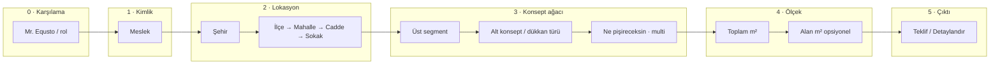
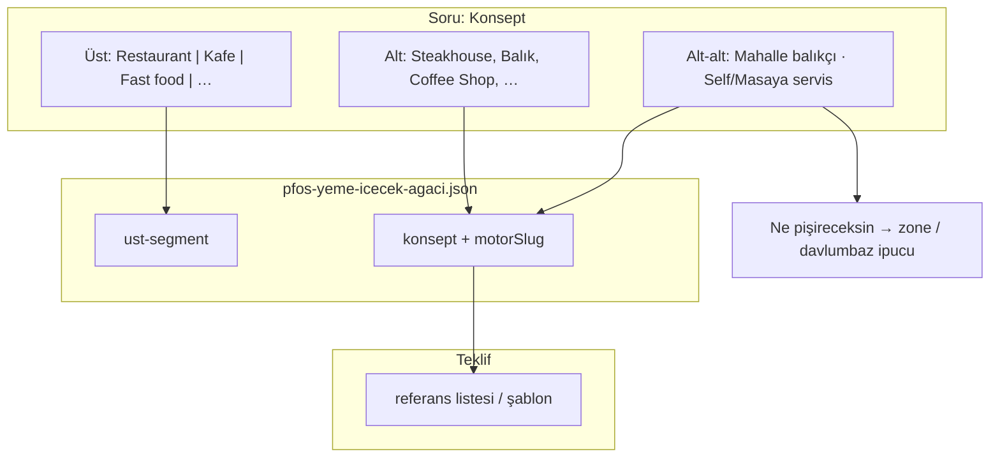
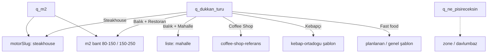

# PFOS — Soru konsepti (EQUSTO Soru Seti v3 ↔ kategori ağacı)

> **Katalog (tüm soru kartları, tablo):** [`PFOS-SORU-KATALOG.md`](./PFOS-SORU-KATALOG.md)

Kaynak not: `EQUSTO SORU SETİ v3.docx` (Proje Fabrikası)  
Kategori referansı: `kategori-agaci/pfos-yeme-icecek-agaci.json`  
Mevcut kod taslağı: `E-TICARET/site/lib/pfos/proje-akis/wizard-questions.ts`

**Amaç:** Konsept listesini ve teklif motorunu besleyen **soru ağacı** — AVM/kat değil; işletme tipi + m² + menü hattı.

---

## 1. UX ilkesi (docx’ten)

| İlke | Uygulama |
|------|----------|
| Sağa açılan paneller | Üst panel kapanmaz; her adım yeni sütun |
| m² zorunlu | Tek sayı → bant/liste seçimi (steakhouse, balıkçı) |
| Opsiyonel alan m² | İkinci faz; zone kataloğu için |
| “Ne pişireceksin?” | Tüm tiplerde menü hattı; m² ile ölçek |
| Son seçim | **Teklifi oluştur** / **Detaylandır** (yardımcı ekipman, çakışmasın) |
| Adres | Nakliye/montaj; AI segment (lokasyon → segment skalası) — ayrı katman |

---

## 2. Soru akışı — şema



---

## 3. Kategori ağacı ↔ soru katmanları



### 3.1 Yeme-içecek — docx ile eşleme (öncelik: hazırladığınız konseptler)

| Docx (Soru Seti v3) | `konsept.id` | `motorSlug` | Ek soru |
|---------------------|--------------|-------------|---------|
| Steakhouse | `restaurant_steakhouse` | `steakhouse` | Izgara |
| Balık Restaurant | `restaurant_balik` | `balikci` | Balık / deniz |
| Mahalle Balıkçısı / Lokanta | `restaurant_balik` | `balikci` | **alt tip** → `mahalle` listesi |
| Kebapçı | `restaurant_kebap` | `kebap-ortadogu` | Kebap |
| Coffee Shop / Cafe | `coffee_shop` | `coffee-shop` | Kahve / içecek |
| All Dining Cafe | `all_day_dining` | `all-day-dining-cafe` | Karma menü |
| Pizzacı | `pizzaci` | `pizzaci` | Pizza hattı |
| Türk / Esnaf lokanta | `turk_restoran` | `turk-restoran` | Ev yemekleri |
| Meyhane | `meyhane` | `meyhane` | Meze / bar |
| Burger / FC / Döner / Pide | `fast_food` | — | Alt tip; motor **planlanan** |
| Pastane / Artisan bakery | `pastane` | — | planlanan |

### 3.2 Docx’te var — PFOS ağacında henüz yok (soru konseptine ekle, konsept sonra)

| Docx dalı | Önerilen `ust-segment` | Not |
|-----------|------------------------|-----|
| Fine Dining, Dünya Mutfağı, Gurme Şarküteri | Restaurant | Alt konsept veya `ne_pisireceksin` |
| Seafood Bistro | Restaurant → balikci alt tip | |
| Self Servis / Masaya Servis | **Soru** (servis modeli) | Listeyi değiştirmez; oturma/ölçek |
| Bulut Mutfak | Üretim / cloud | Ayrı üst dal |
| Hotel (Oda&Kahvaltı, A la carte, …) | Otel | Menü tipi sorusu |
| Bar (kokteyl, wine, pub…) | Bar | İçecek ağırlıklı |
| Catering | Catering | kg/gün veya porsiyon |
| Üretim fabrikası (500–10000 m²) | Üretim | m² bantları docx’te tanımlı |

Bu dallar **soru setinde görünür** olabilir; motor bağlanana kadar `durum: planlanan` + “liste hazırlanıyor” mesajı.

---

## 4. Soru kartları (uygulanabilir taslak)

Her kart: `id`, `step`, `panel`, `type`, `options`, `gosterIf`, `etki`.

### Panel A — Meslek (docx uyumlu)

```
id: q_meslek
options: Yatırımcı | Şef/Aşçı | Satınalmacı | Mimar | Franchise | Söylemek istemiyorum
etki: yok (analitik / ton)
```

### Panel B — Adres

```
q_sehir      → zorunlu
q_ilce       → zorunlu
q_mahalle    → opsiyonel
q_cadde      → opsiyonel
q_sokak      → opsiyonel
not: Nakliye ve montaj için
etki: lokasyon segmenti (AI); montaj satırı
```

### Panel C — Konsept (iki kademe + docx derinliği)

**C1 — Üst segment** (`q_ust_segment`)

```
Restaurant | Kafe-Kafeterya | Fast food | Pastane | Otel | Bar | Catering | Üretim | Bilmiyorum
```

**C2 — Dükkan türü** (`q_dukkan_turu`) — `gosterIf: ust_segment`

| ust_segment | options (özet) |
|-------------|----------------|
| Restaurant | Steakhouse, Balık…, Kebapçı, Meyhane, All Dining, Pizzacı, Türk/Esnaf, Fine Dining, Dünya, Şarküteri, Bilmiyorum |
| Kafe | Coffee Shop, Kafeterya, Bilmiyorum |
| Fast food | Burger, Pizza, Fried Chicken, Döner, Pide-Lahmacun, Bilmiyorum |
| Pastane | Artisan, Endüstriyel, (Gelato sonra), Bilmiyorum |

**C3 — Balık alt tipi** (`q_balik_alt`) — `gosterIf: dukkan ≈ balık`

```
Mahalle balıkçısı | Balık Restaurant | Balık lokantası | Seafood bistro
→ motor: balikci + liste: mahalle | 80-150 | 150-250
```

**C4 — Ne pişireceksin** (`q_ne_pisireceksin`) — `multi_select`, docx: tüm tiplerde

```
Izgara | Balık-deniz | Kebap | Pizza | Kahve-içecek | Pastane-fırın | Meze | Ev yemekleri | Bilmiyorum
etki: zone ipuçları (davlumbaz, pişirme grubu); konsept doğrulama
```

### Panel D — Ölçek

```
q_m2_toplam     number, zorunlu
→ steakhouse/balikci: pickM2Bant(m2)
→ coffee-shop: referans liste + m2 ölçek

q_m2_alanlar    opsiyonel, faz 2 (mutfak, salon, depo…)
```

### Panel E — Karar

```
q_cikti: Teklifi oluştur | Projeyi detaylandır
detaylandır → 6 yardımcı ekipman önerisi (teklifle çakışmasın)
```

---

## 5. Koşullu mantık özeti



---

## 6. `wizard-questions.ts` → hedef farklar

| Mevcut | Docx / hedef |
|--------|----------------|
| 7 soru, düz liste | Panel zinciri, 15+ kart |
| Konsept 6 seçenek | Üst + alt + balık alt tip |
| m2 tek soru | + opsiyonel alan m² |
| Lokasyon metin | İlçe/mahalle/cadde ayrı |
| Karar: PDF | PDF + detaylandır |

Öneri: Soruları `proje-akis.json` içinde tut; `wizard-questions.ts` yalnızca varsayılan seed. Kategori ağacındaki `konsept.id` = `shopTypes[].id` = `q_dukkan_turu` eşlemesi.

---

## 7. Sizin konsept çalışmanız + benim rolüm

| Siz | Soru konsepti (bu dosya) |
|-----|---------------------------|
| `motorSlug`, referans Excel, ölçek matrisi | Hangi soru hangi listeyi açar |
| `shopTypes` / proje-akis | Panel sırası, `gosterIf` kuralları |
| Yeni konsept (sushi, italyan…) | Ağaca `konsept` düğümü + docx satırı ekle |

**Sonraki somut çıktılar (isterseniz):**

1. `pfos-soru-seti-v3.json` — tüm soru kartları + `gosterIf` + `mapsToKonseptId`
2. Eşleşmeyen 41 örnek marka → konsept önerisi (ağaç genişletme)
3. Otel / Bar / Catering için ayrı kök dal şeması (yeme-içecek dışı)

---

## 8. Kısa kontrol listesi

- [ ] Üst segment listesi docx ile aynı mı?
- [ ] Her **aktif** `motorSlug` için bir `q_dukkan_turu` yolu var mı?
- [ ] Balık için mahalle sorusu → `mahalle` JSON
- [ ] m² her konsepte `m2Min`–`m2Max` içinde mi?
- [ ] “Ne pişireceksin” zone motoruna bağlanacak mı (şimdi / sonra)?
- [ ] Planlanan konseptlerde kullanıcıya net mesaj?

---

*Güncelleme: kategori ağacı v1 — AVM kaldırıldı, yalnızca PFOS yeme-içecek.*
