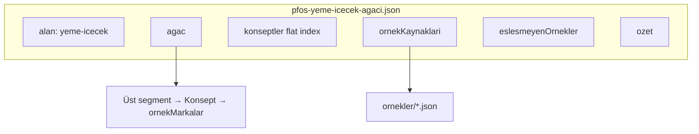
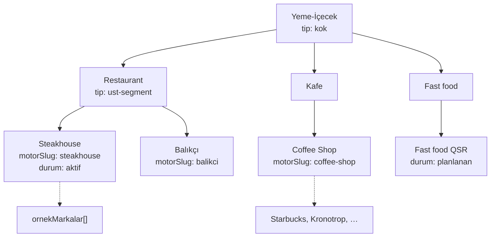
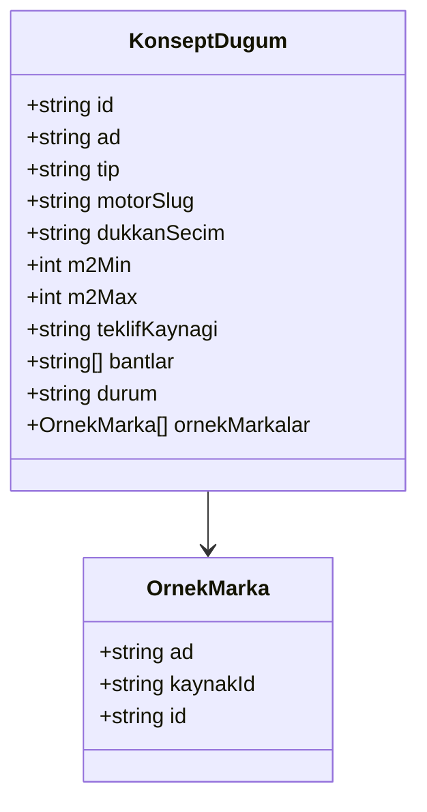
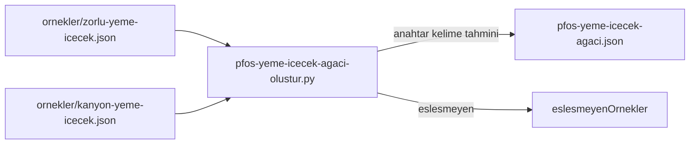
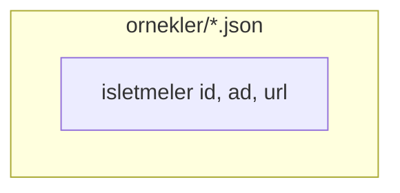
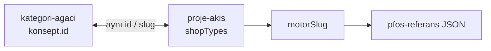

# PFOS Yeme-İçecek — şema

Ana veri: **`pfos-yeme-icecek-agaci.json`**

---

## 1. Kök yapı

---

## 2. Ağaç hiyerarşisi (PFOS)

**`tip` değerleri:** `kok` | `ust-segment` | `konsept`

---

## 3. Konsept düğümü (alanlar)

| durum | Anlam |
|--------|--------|
| `aktif` | Motor + referans listesi bağlı |
| `motor` | Motor şablonu var, referans Excel/JSON bekleniyor |
| `planlanan` | Henüz `motorSlug` yok |

| teklifKaynagi | Anlam |
|----------------|--------|
| `pfos-referans` | `public/data/pfos-referans/` |
| `referans-json` | `veri/proje-veri` → seed |
| `motor-sablon` | Zone / sabit TS şablonu |
| `planlanan` | — |

---

## 4. Örnek markalar (yardımcı katman)

AVM yok — yalnızca isim havuzu:

---

## 5. shopTypes / motor köprüsü

---

## 6. Güncel özet (örnek çalıştırma)

| | |
|--|--|
| Konsept | 10 |
| Aktif motor | 4 (steakhouse, balikci, coffee-shop, kebap) |
| Örnek işletme | 98 (zorlu + kanyon) |
| Eşleşmeyen | Manuel sınıflandırma için ayrı liste |

Eşleşmeyenler yeni konsept veya kural genişletmesi için iş kuyruğu — AVM/kat ile ilgisi yok.
